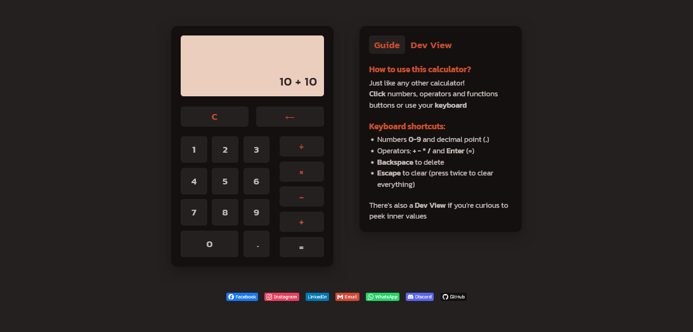

# Calculator 

A simple yet functional calculator built using basic HTML, CSS, and JavaScript. I made this project while learning and practicing my JavaScript knowledge.

## How to Use

Just like any regular calculator!

You can **click** the buttons or use your **keyboard**:

- Numbers `0–9` and `.` for decimals
- Operators: `+ - * /` and `Enter` to calculate
- `Backspace` to delete
- `Escape` to clear (press twice to clear everything)

There's also a **Dev View** if you're curious to peek inner values

## Technologies Used

- HTML
- CSS
- JavaScript
